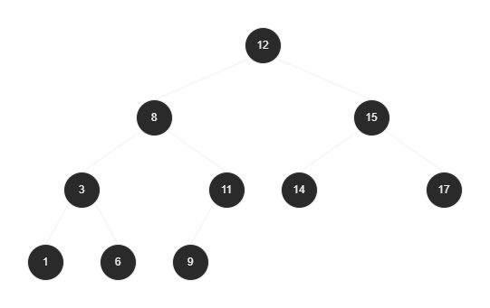
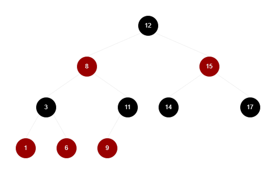
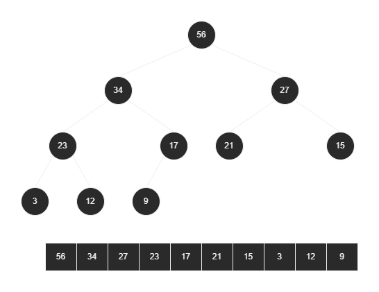
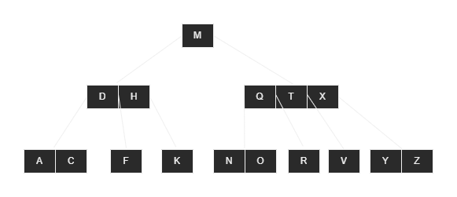
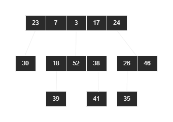

# Datastructures

Originated through my preparation for the exams in modules `Object-Oriented Programming` and `Algorithms and Datastructures`. 

## Single linked list :heavy_check_mark:

| Reference  | Note                              |
|------------|-----------------------------------|
| Successor  | the following element in the list |

## Double linked list :heavy_check_mark:

| Reference   | Note                                           |
|-------------|------------------------------------------------|
| Successor   | the following element in the list              |
| Predecessor | the element in the list before the current one |

### Circular double linked list :heavy_check_mark:

## Stack :heavy_check_mark:

## Queue :heavy_check_mark:

## Hashtable :heavy_check_mark:

## Binary Tree :heavy_check_mark:

| Reference  | Note                           |
|------------|--------------------------------|
| Parent     | the parent element in the tree |
| LeftChild  | the element following left     |
| RightChild | the element following right    |

## Red-Black-Tree :heavy_check_mark:

## Heap :heavy_check_mark:

## B-Tree :x:

## Fibonacci-Heap :heavy_check_mark:

| Reference/Attribute | Note                           |
|---------------------|--------------------------------|
| Parent              | the parent element in the tree |
| LeftNeighbour       | the element following left     |
| RightNeighbour      | the element following right    |
| Child               | the children in a list         |
| Degree              | amount of children             |
| Mark                | flag set when lost a child     |
| Key                 | priority of the node           |
