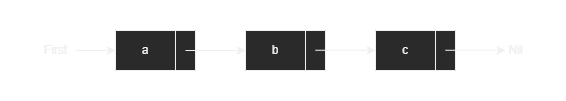
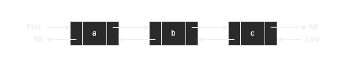
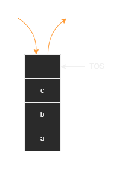
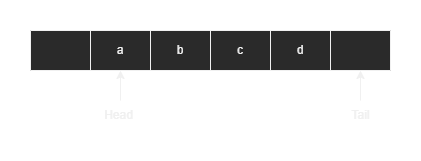
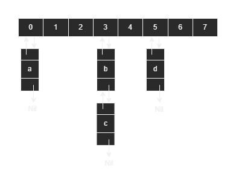

# Datastructures

Originated through my preparation for the exams in modules `Object-Oriented Programming` and `Algorithms and Datastructures`. 

## Single linked list :heavy_check_mark:

|Reference|Note|
|---|---|
|Successor|the following element in the list|

## Double linked list :heavy_check_mark:

|Reference|Note|
|---|---|
|Successor|the following element in the list|
|Predecessor|the element in the list before the current one|

### Circular double linked list :heavy_check_mark:

## Stack :heavy_check_mark:

## Queue :heavy_check_mark:

## Hashtable :heavy_check_mark:

## Binary Tree :heavy_check_mark:

## Red-Black-Tree :x:

## B-Tree :x:

## Heap :x:

## Fibonacci-Heap :x:
